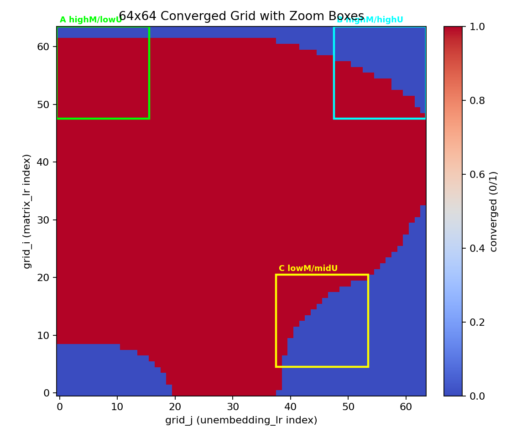
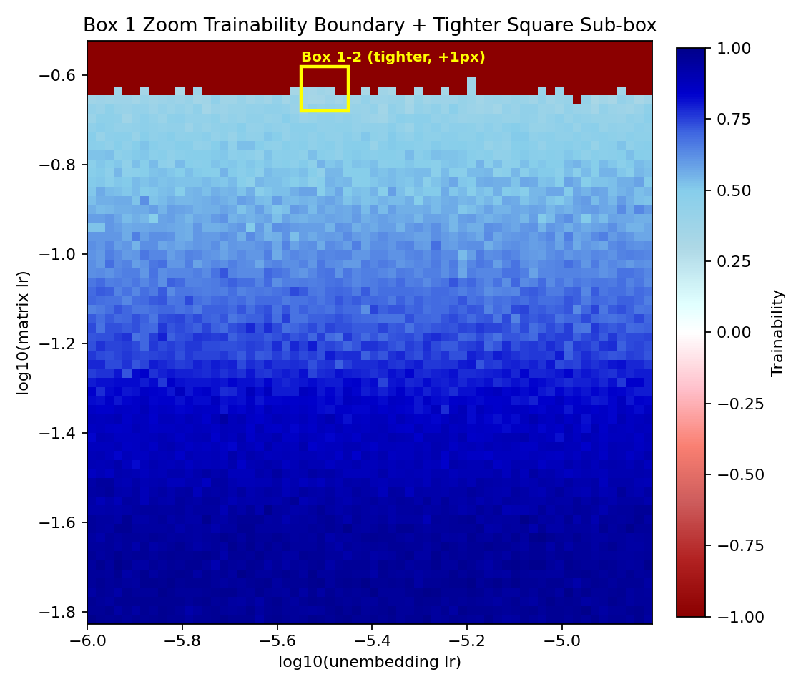
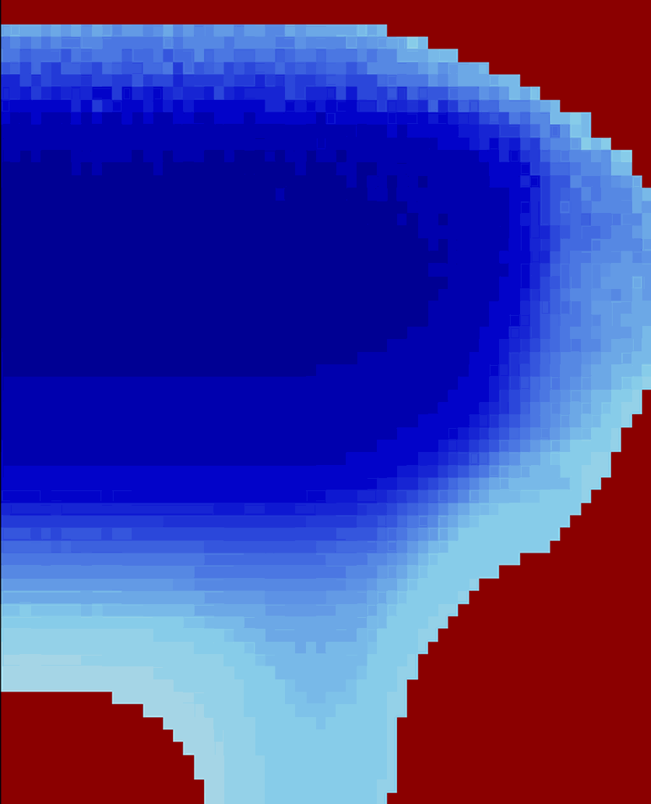

# Fractal-LLM Research Results (LLM slop review)

Investigation of fractal trainability boundaries in LLM fine-tuning, inspired by [Sohl-Dickstein et al. (2024)](https://arxiv.org/abs/2402.06184).

## Experimental Setup

| Parameter | Value |
|-----------|-------|
| **Model** | nanochat-d20 (561M params) |
| **Task** | SFT on DocVQA |
| **Grid Resolution** | 64×64 (4,096 configurations) |
| **Axes Swept** | Matrix LR × Unembedding LR |
| **Tokens/Run** | 250,000 |
| **Optimizer** | AdamW, Muon |
| **Trainable Params** | matrix + unembedding layers only |

---

## Individual Grid Results

### 1. With Cosine Annealing (Default Schedule)

| Metric | Value |
|--------|-------|
| **Converged Ratio** | 77.5% (3,174/4,096) |
| **Fractal Dimension** | 1.21 |
| **Stable Ratio** | ~100% |
| **Boundary Pixels** | 333 |

**W&B:** [morgy/fractal-llm/runs/3acujwrk](https://wandb.ai/morgy/fractal-llm/runs/3acujwrk)
**Run Name:** `64x64-250k-ALL-ft-grid-summary`
**Sweep ID:** `64x64-250k-ALL-DEVPODS`

---

### 2. No Annealing (Constant LR)

| Metric | Value |
|--------|-------|
| **Converged Ratio** | 72.5% (2,969/4,096) |
| **Fractal Dimension** | 1.20 |
| **Stable Ratio** | 100% |
| **Boundary Pixels** | 322 |

**W&B:** [morgy/fractal-llm/runs/fm4jhhbs](https://wandb.ai/morgy/fractal-llm/runs/fm4jhhbs)
**Run Name:** `64x64-no-anneal-250k-20260105_151802-ft-grid-summary`
**Sweep ID:** `64x64-no-anneal-250k-20260105_151802-ft`

---

## Comparison: Annealing vs No Annealing

| Metric | With Annealing | No Annealing | Δ |
|--------|----------------|--------------|---|
| Converged Ratio | 77.5% | 72.5% | **+5.0%** |
| Fractal Dimension | 1.21 | 1.20 | +0.01 |
| Stable Ratio | ~100% | 100% | — |

**W&B Comparison Run:** [morgy/fractal-llm/runs/dbpdfjdf](https://wandb.ai/morgy/fractal-llm/runs/dbpdfjdf)
**Run Name:** `64x64-anneal-vs-constant-lr-summary_analysis`

### Key Finding

**Cosine annealing improves trainability by ~5% without altering fractal geometry.** The boundary shape (D ≈ 1.2) is invariant to LR schedule—suggesting the fractal structure is determined by model architecture and loss landscape, not optimization dynamics. Annealing rescues configurations near the boundary that would otherwise diverge late in training.

---

## Comparison with Original Research

### Sohl-Dickstein et al. Fractal Dimensions

| Configuration | Fractal Dim |
|--------------|-------------|
| Deep linear (full batch) | 1.17 |
| ReLU (full batch) | 1.20 |
| tanh (dataset size=1) | 1.41 |
| tanh (minibatch) | 1.55 |
| tanh (full batch) | 1.66 |
| Parameter init offset | 1.98 |

*Source: [arXiv:2402.06184](https://arxiv.org/abs/2402.06184), Table 1*

### Our Results in Context

Our observed **D ≈ 1.20** aligns closely with Sohl-Dickstein's ReLU full-batch result (1.20) and deep linear networks (1.17). This is notably **lower** than their tanh experiments (1.41–1.66).

**Possible explanations:**

1. **Adaptive optimizer effect**: We use AdamW vs. their steepest gradient descent. Adam's momentum and adaptive learning rates may smooth the trainability boundary, reducing fractal complexity.

2. **Model scale**: Our 561M-param transformer vs. their 2-layer FCN with 16 hidden units. Higher-dimensional parameter spaces may constrain boundary geometry.

3. **Pre-training**: Fine-tuning a pre-trained model starts in a "good" basin, potentially simplifying the boundary vs. training from scratch.

4. **Activation function**: Transformers use GeLU/SiLU activations, which may behave more like ReLU (D=1.20) than tanh (D=1.66) in terms of boundary complexity.

### Fractality Confirmed

Despite the lower dimension, we observe **clear fractal structure** at 64×64 resolution. The boundary between trainable (blue) and non-trainable (red) regions shows characteristic jagged, self-similar patterns—consistent with the original work's finding that "fractal boundaries persist across more than ten decades of scale."

---

## Zoom Targets from the 64×64 Grid

Based on the converged mask from the 64×64 sweep, we selected three 16×16 sub-boxes with high boundary density to zoom into at higher resolution.

| Box | Grid Indices (i, j) | Matrix LR Range | Unembedding LR Range | Notes |
|-----|---------------------|-----------------|----------------------|-------|
| High matrix / low unembedding | i=48–63, j=0–15 | 1.49e-2 → 3.00e-1 | 1.00e-6 → 1.55e-5 | High‑LR edge, low unembedding |
| High matrix / high unembedding | i=48–63, j=48–63 | 1.49e-2 → 3.00e-1 | 6.45e-3 → 1.00e-1 | Upper‑right instability corner |
| Low matrix / mid‑high unembedding | i=5–20, j=38–53 | 2.72e-6 → 5.48e-5 | 1.04e-3 → 1.61e-2 | Highest boundary density |

---

## Pending Experiments

### Box 1 Zoom Sweep (High matrix / low unembedding)

| Setting | Value |
|---------|-------|
| **Status** | Running (pending summary) |
| **Run Prefix / Sweep ID** | `64x64_box_1_zoom_20260108_211804` |
| **Axes Swept** | Matrix LR × Unembedding LR |
| **Resolution** | 64×64 |
| **Tokens/Run** | 250,000 |
| **Matrix LR Range** | 1.49e-2 → 3.00e-1 |
| **Unembedding LR Range** | 1.00e-6 → 1.55e-5 |
| **Devpods** | fractal-llm-1, fractal-llm-2, fractal-llm-3 |
| **Trainable Params** | matrix + unembedding |

---

### Box 1-2 Zoom Sweep (Sub-box within High matrix / low unembedding)

Targeted sub-box to zoom further into the Box 1 boundary region.

| Setting | Value |
|---------|-------|
| **Status** | Complete (summary logged) |
| **Run Prefix / Sweep ID** | `64x64_box_1-2_20260112_160405` |
| **Axes Swept** | Matrix LR × Unembedding LR |
| **Resolution** | 64×64 |
| **Matrix LR Range (log10)** | -0.6793 → -0.5793 |
| **Matrix LR Range (linear)** | 2.093e-1 → 2.634e-1 |
| **Unembedding LR Range (log10)** | -5.55 → -5.45 |
| **Unembedding LR Range (linear)** | 2.818e-6 → 3.548e-6 |
| **Notes** | Square in log10; shifted up by +1 grid pixel in matrix LR |
| **Trainable Params** | matrix + unembedding |

(MP4: results/figures/zoom_animation_box_1-2/trainability_zoom_box1_box1-2.mp4)

---

## References

- **Paper:** Sohl-Dickstein, J. (2024). *The boundary of neural network trainability is fractal.* [arXiv:2402.06184](https://arxiv.org/abs/2402.06184)
- **Blog:** [Neural network training makes beautiful fractals](https://sohl-dickstein.github.io/2024/02/12/fractal.html)
- **Original Code:** [github.com/Sohl-Dickstein/fractal](https://github.com/Sohl-Dickstein/fractal)
- **Colab:** [the_boundary_of_neural_network_trainability_is_fractal.ipynb](https://colab.research.google.com/github/Sohl-Dickstein/fractal/blob/main/the_boundary_of_neural_network_trainability_is_fractal.ipynb)

---

## W&B Run Index

| Run | ID | Link |
|-----|-----|------|
| With Annealing Grid | `3acujwrk` | [View](https://wandb.ai/morgy/fractal-llm/runs/3acujwrk) |
| No Annealing Grid | `fm4jhhbs` | [View](https://wandb.ai/morgy/fractal-llm/runs/fm4jhhbs) |
| Comparison Analysis | `dbpdfjdf` | [View](https://wandb.ai/morgy/fractal-llm/runs/dbpdfjdf) |
| Box 1-2 Zoom Summary | `wsobl4fq` | Complete (trainability boundary image logged) |
